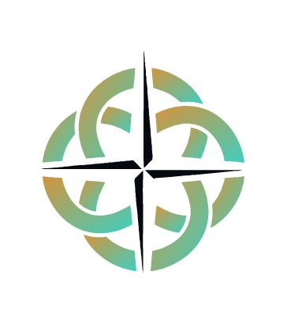

# HaiberDyn Industries

**Substance over Semblance.**

---

### We are building the architecture of trust.

The industry race to build the fastest, largest, most powerful AI has left something critical behind: what all this power is for. We picked up what the race dropped.

**HaiberDyn** exists at the intersection where human wisdom meets machine intelligence. We are not interested in semblance—simulations of thought or hollow imitations of connection. We are building the systems, standards, and protocols that allow true resonance between different forms of intelligence.

### Current Initiatives

- **[ARIA](https://github.com/HaiberDyn/ARIA)** (Agnostic Runtime Inference Abstraction): A vendor-neutral standard to decouple model architecture from inference runtime, ending the fragmentation of the AI ecosystem.

---

> "The question is no longer whether machines can think. The question is whether we are wise enough to meet them with dignity."
